# Obtaining USPTO PFW MCP Server API Keys

Several tools require API keys to function. For the USPTO PFW MCP Server:

- **USPTO API Key**: Required and free
- **Mistral API Key**: Optional, has a free tier for testing, but paid plan recommended for production use

Follow these steps to obtain your API keys:

---

## USPTO.gov API Key

### Step 1: Create USPTO.gov Account

1. Visit: https://account.uspto.gov/profile/create-account
2. Fill out form and create a USPTO.gov account

---

### Step 2: Link ID.me Verification

3. Go to https://data.uspto.gov/myodp/landing
4. Choose which option fits your situation:

**Option A:** I have a USPTO.gov account, but... **"I need to link my ID.me account"**

**Option B:** I have a USPTO.gov account, but... **"I don't have an ID.me account"**

**About ID.me:**
- ID.me is a non-government account provider that contracts with government and non-government organizations
- You will need to have identification documents ready
- Verification options: Self-service or Video Call
- See: https://help.id.me/hc/en-us/articles/360051696334-Upload-your-ID-documents-to-ID-me

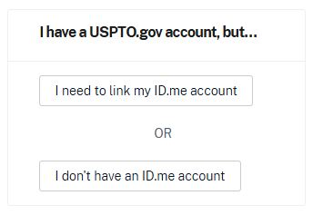

---

### Step 3: Access Your API Key

5. Once both your USPTO.gov account and ID.me verification are complete, return to https://data.uspto.gov/myodp/landing
6. Click the button **"Log in using USPTO.gov account"** in the section "I have a USPTO.gov account, and it's verified with ID.me"

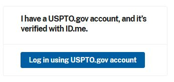

7. Once logged in, you should see your API Key displayed on the dashboard

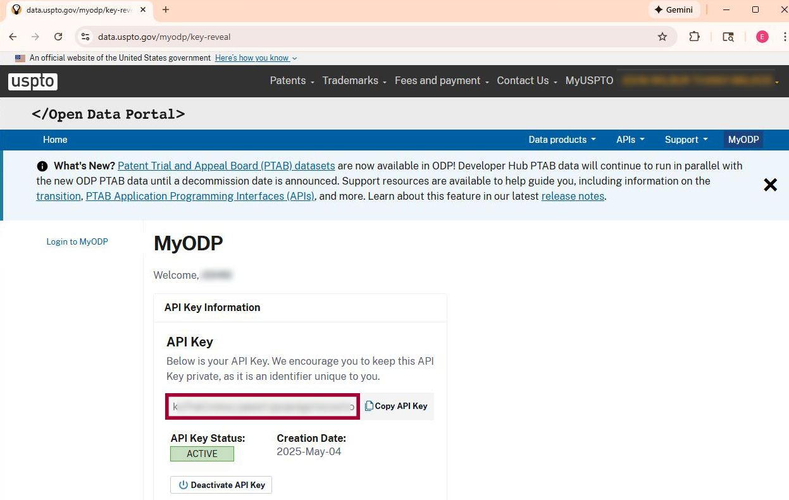

---

### Step 4: Secure Storage

8. Record the API key in a secure location
   - **Important**: USPTO does not provide a way to change your API key
   - Safeguard this key carefully - treat it like a password

9. When running the deployment script, paste the API key when prompted:
   ```
   Enter your USPTO API key:
   ```

---

## Mistral API Key (for OCR)

### Step 1: Create Account

1. Visit: https://v2.auth.mistral.ai/login
2. Sign up using one of these methods:

   **Option A:** Link to your existing Apple, Google, or Microsoft account

   **OR**

   **Option B:** Enter an email address:
   - Fill out the registration form
   - Receive verification email
   - Enter the code from the email

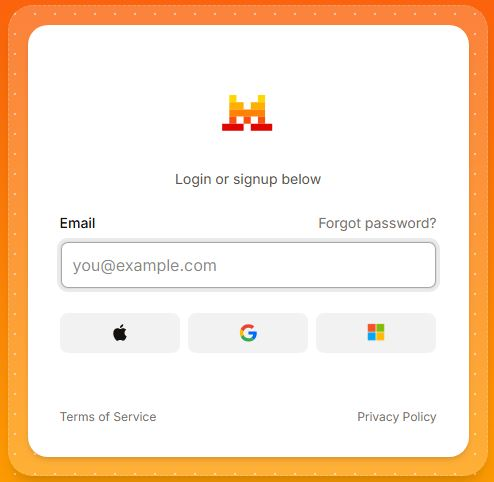

---

### Step 2: Organization Setup

3. Go to https://admin.mistral.ai/ and login
4. Create your organization
5. Read and accept the Terms of Service and Privacy Policy

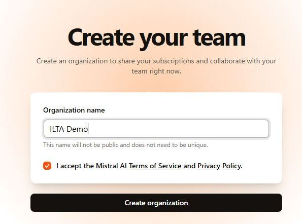

---

### Step 3: Choose a Plan

6. Navigate to API Keys section
7. Click **"Choose a plan"**

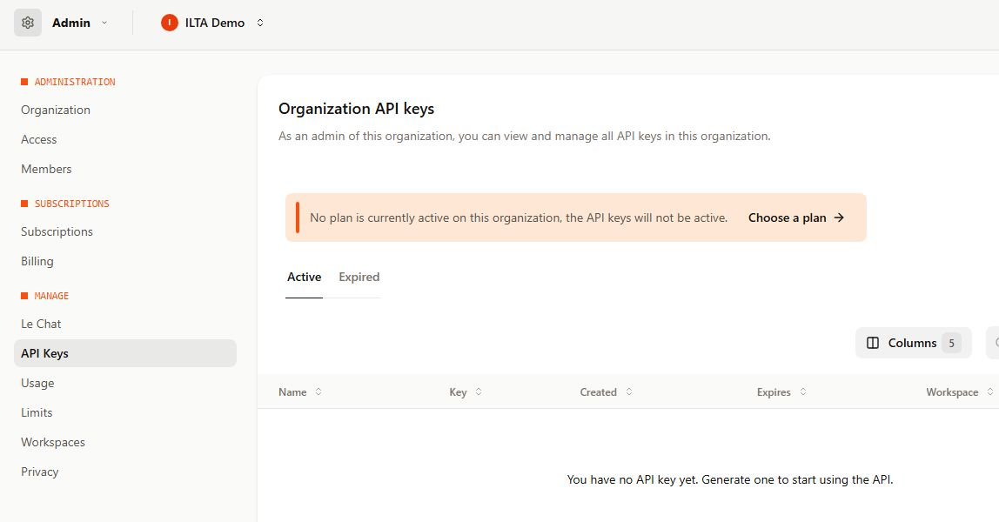

8. Review available plans and select the one that fits your needs

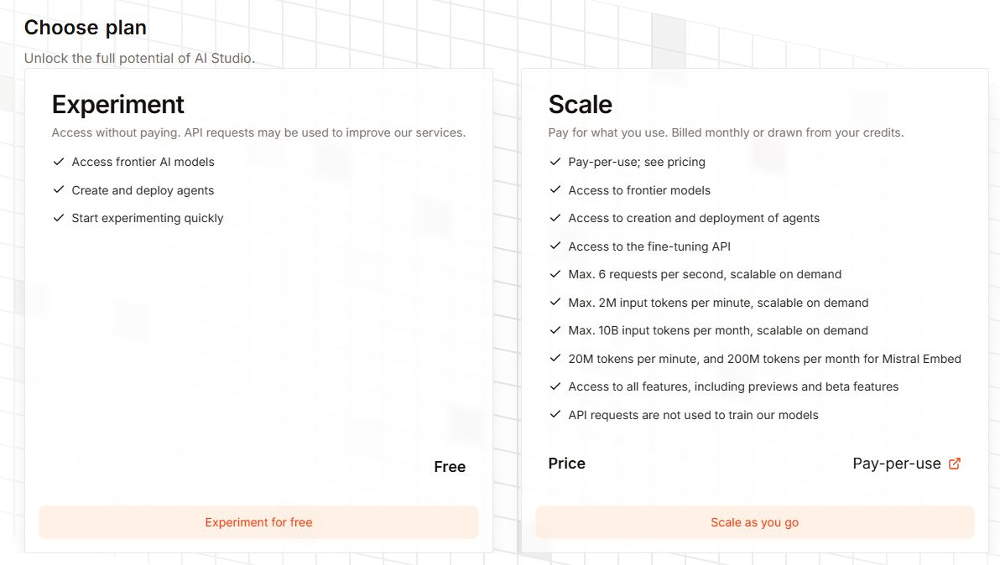

9. Read and accept the Terms of Service and Privacy Policy (only if you agree)

---

**⚠️ Important Information Governance Note:**

The USPTO PFW MCP server (and all of the author's USPTO MCP servers) only use Mistral OCR to have the LLM read **publicly available USPTO documents**. This usage should not raise information governance concerns.

However, if you use the API key separately outside the scope of the USPTO PFW MCP to:
- Scan and OCR client documents
- Use other Mistral API endpoints (e.g., chat API)

Then the **free tier may not be appropriate** due to the terms of service stating: **"API requests may be used to improve our services"**

---

### Step 4: Verify Phone Number

10. Verify your phone number

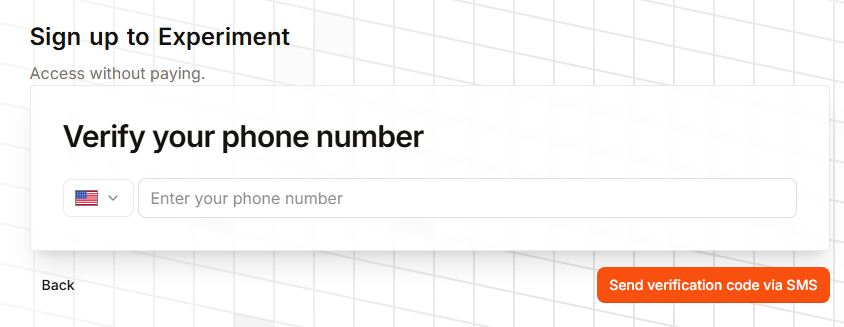

---

### Step 5: Generate API Key

11. Return to API Keys section - the **"Create new key"** button should now be clickable

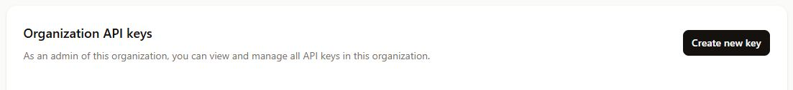

12. Fill out the key creation form:
    - **Key name**: Descriptive name (e.g., "USPTO PFW MCP OCR")
    - **Workspace**: Select appropriate workspace (e.g., "Default Workspace")
    - **Expiration**: Optional but recommended for security

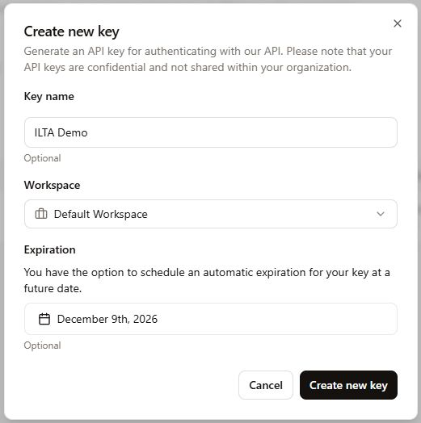

13. Click **"Create new key"**

---

### Step 6: Secure Storage

14. Copy your API Key immediately - **it is only displayed once**

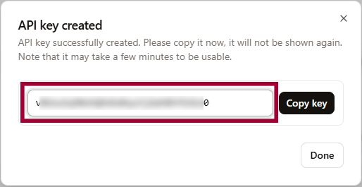

15. Store the key in a secure location

16. When running the deployment script, paste the API key when prompted:
    ```
    Enter your Mistral API key (or press Enter to skip):
    ```
    - You can press Enter to skip if you want to set this up later via the `C:\Users\[USERNAME]\uspto_pfw_mcp\deploy\manage_api_keys.ps1` script

---

## Summary

✅ **USPTO API Key**: Required, free, no rotation available - safeguard carefully

✅ **Mistral API Key**: Optional, free tier available, paid recommended for production

Both keys are stored securely by the deployment script using Windows DPAPI encryption for the secure configuration method.

For troubleshooting or key management after installation, use the API key management script:
```powershell
C:\Users\[USERNAME]\uspto_pfw_mcp\deploy\manage_api_keys.ps1
```
