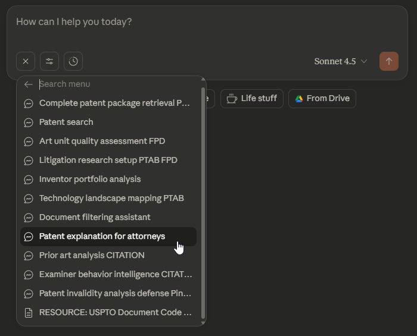
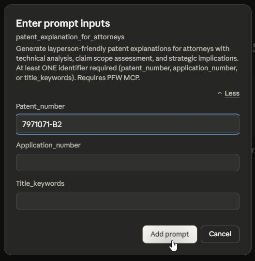
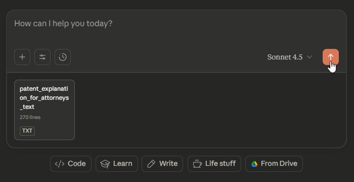

# USPTO Patent File Wrapper MCP - Prompt Templates

This document details the sophisticated prompt templates included with the USPTO Patent File Wrapper MCP Server for complex patent workflows.

## ⚡️ Prompt Templates (Attorney-Friendly Workflows)

**NEW FEATURE**: The PFW MCP now includes 11 prompt templates that appear in Claude Desktop UI. These templates automate complex multi-step workflows and eliminate the need to memorize tool syntax.

### 🎯 **How to Use Prompt Templates**

1. **In Claude Desktop**: Press the `+` button

   

2. **Select "Add from uspto_pfw"** from the dropdown menu

   

3. **Select the desired Prompt** from the dropdown menu.  Note some prompts require the installation of the developer's other USPTO or Pinecone MCP servers those requirements are denoted in the title of the Prompt, e.g. Technology landscape mappings PTAB you would need the USPTO PTAB MCP in addition to the USPTO PFW MCP

   

4. **Fill in the parameters** (app numbers, company names, etc.) Read the guidance for which fields are required and format of some fields

   

5. **Execute - (Recommendation: Type in "Perform the Prompt" before hitting Execute)** - Claude will automatically run the complete workflow

   

## Overview

The MCP server includes AI-optimized prompt templates designed for patent attorneys and IP professionals. These templates provide structured workflows for common legal and research tasks, featuring flexible input processing, cross-MCP integration, and context-efficient guidance.

## 🎯 Legal & Patent Analysis Templates

### `/patent_search` - Find Patents with Partial Information
**Purpose**: Intelligent patent discovery when you have incomplete information
**Key Features**:
- **Multi-strategy search**: Fuzzy matching, title keyword search, inventor variations
- **Flexible input**: Accepts patent numbers, application numbers, or title keywords
- **Smart validation**: Automatic input type detection and guidance
- **Progressive disclosure**: Starts with minimal searches for efficiency

**Use Cases**:
- "Find the patent about OLED displays by John Smith"
- "Look for Apple's facial recognition patents from 2019"
- "Search for continuation applications related to wireless charging"

**Integration**: Works standalone or as foundation for cross-MCP workflows

---

### `/patent_explanation_for_attorneys` - Technical-to-Legal Translation
**Purpose**: Generate clear layperson explanations for legal professionals
**Key Features**:

- **Technical translation**: Converts complex engineering concepts to accessible language
- **Strategic context**: Highlights legal implications and prosecution strategies
- **Client-ready outputs**: Professional explanations suitable for client communications
- **Prior art awareness**: Identifies potential invalidity arguments and claim construction issues

**Use Cases**:
- Explaining complex software patents to non-technical stakeholders
- Preparing client presentations on patent portfolio value
- Creating executive summaries for licensing negotiations
- Developing layperson claim interpretations for litigation

**Integration**: Often used after `pfw_get_patent_or_application_xml` for structured content analysis

---

### `/patent_invalidity_analysis_defense_Pinecone_PTAB_FPD_Citations` - Comprehensive Defense Analysis
**Purpose**: Advanced invalidity analysis for defensive patent litigation
**Key Features**:
- **§ 112 indefiniteness analysis**: Systematic claim construction review
- **5-MCP integration**: Combines PFW + PTAB + FPD + Citations + Pinecone
- **PTAB risk assessment**: Evaluates potential IPR/PGR challenges
- **Citation pattern analysis**: Leverages examiner citation effectiveness (Oct 2017+)
- **FPD petition correlation**: Examiner procedural pattern analysis
- **Pinecone auto-configuration**: Detects RAG setup for optimal token budgeting
- **Ultra-minimal Step 1**: Reduces context waste through targeted discovery

**Use Cases**:
- Responding to NPE assertion letters
- Preparing invalidity contentions for litigation
- Due diligence for patent acquisition defense
- Pre-litigation patent strength assessment

**Integration**: Requires USPTO PTAB MCP + Citations MCP + FPD MCP; enhanced with Pinecone Assistant/RAG MCP for MPEP guidance

## 📊 Prosecution & Research Templates

### `/art_unit_quality_assessment_FPD` - Examiner Pattern Analysis
**Purpose**: Analyze art unit prosecution patterns and examiner behavior
**Key Features**:
- **Grant rate analysis**: Statistical assessment of art unit performance
- **Examiner pattern recognition**: Individual examiner granting/rejection trends
- **Petition history tracking**: FPD integration for procedural issue analysis
- **Strategic recommendations**: Data-driven prosecution strategy guidance

**Use Cases**:
- Selecting optimal art units for continuation applications
- Preparing for examiner interviews and responses
- Identifying petition-prone examiners for procedural planning
- Quality assessment for patent portfolio strategy

**Integration**: Enhanced with USPTO FPD MCP for petition decision analysis

---

### `/litigation_research_setup_PTAB_FPD` - Multi-Database Litigation Prep
**Purpose**: Comprehensive litigation preparation workflow
**Key Features**:
- **Multi-database integration**: Orchestrates PFW + PTAB + FPD searches
- **Strategic analysis framework**: Identifies strengths and vulnerabilities
- **Timeline reconstruction**: Maps prosecution through post-grant challenges
- **Evidence compilation**: Organizes discovery materials and expert witness support

**Use Cases**:
- Preparing for Section 337 ITC investigations
- Defensive patent litigation strategy development
- Post-grant challenge preparation and response
- Patent portfolio acquisition due diligence

**Integration**: Requires USPTO PTAB MCP and USPTO FPD MCP for complete analysis

---

### `/technology_landscape_mapping_PTAB` - Competitive Intelligence
**Purpose**: Technology sector analysis with PTAB risk assessment
**Key Features**:
- **Market analysis**: Competitive patent landscape mapping
- **PTAB risk assessment**: Identifies patents vulnerable to challenges
- **Technology trend identification**: Evolution analysis across patent families
- **Strategic positioning**: Competitive advantage and white space identification

**Use Cases**:
- R&D investment planning and technology roadmaps
- Competitive intelligence for business development
- Patent portfolio optimization and pruning decisions
- Technology acquisition target assessment

**Integration**: Enhanced with USPTO PTAB MCP for challenge risk analysis

## 📁 Document Management Templates

### `/complete_patent_package_retrieval_PTAB_FPD` - Comprehensive Document Retrieval
**Purpose**: Systematically retrieve complete patent documentation
**Key Features**:
- **Cross-MCP intelligence**: Integrates PFW + PTAB + FPD data
- **Red flag analysis**: Identifies PTAB vulnerabilities and FPD petition risks
- **Package type selection**: Basic (4 docs) / Prosecution (10-15 docs) / Full (20-40 docs)
- **Organized downloads**: Structured metadata with proxy download URLs
- **Professional filenames**: Attorney-friendly naming conventions
- **Status tracking**: Real-time download progress and completion status

**Use Cases**:
- Due diligence document packages with risk assessment
- Litigation discovery with PTAB/FPD intelligence
- Patent portfolio auditing with cross-MCP insights
- Client deliverable preparation with comprehensive analysis

**Integration**: Requires USPTO PTAB MCP + FPD MCP for comprehensive intelligence

---

### `/document_filtering_assistant` - Smart Document Selection
**Purpose**: Context-aware document filtering for targeted analysis
**Key Features**:
- **Purpose-driven selection**: Filters documents based on analysis goals
- **Context reduction**: Achieves 98.6% token reduction for heavily-prosecuted applications
- **Intelligent prioritization**: Selects most relevant documents automatically
- **Cost optimization**: Minimizes OCR costs through strategic selection

**Use Cases**:
- Preparing focused document sets for LLM analysis
- Reducing costs in high-volume patent research
- Targeted prior art analysis from prosecution history
- Expert witness preparation with key documents

**Integration**: Works with `pfw_get_application_documents` for advanced filtering

---

### `/inventor_portfolio_analysis` - Inventor Tracking & Analysis
**Purpose**: Comprehensive inventor patent portfolio mapping
**Key Features**:
- **Technology tracking**: Maps inventor expertise across patent families
- **Career progression analysis**: Tracks inventor movement and technology evolution
- **Strategic insights**: Identifies key inventors and technology clusters
- **Portfolio visualization**: Organizes patents by technology area and timeline

**Use Cases**:
- Prior art searches focused on specific inventors
- Technology transfer and licensing opportunity identification
- Competitive intelligence on key technical personnel
- Patent prosecution strategy based on inventor history

**Integration**: Uses multi-strategy inventor search capabilities

---

### `/examiner_behavior_intelligence_CITATION` - Citation Pattern Intelligence
**Purpose**: Deep analysis of examiner citation patterns and prosecution strategies
**Key Features**:
- **Citation effectiveness tracking**: Analyzes which prior art references work with specific examiners
- **Prosecution strategy optimization**: Identifies examiner preferences for argument types
- **Allowance pattern recognition**: Maps examiner decision-making across technology areas
- **Data-driven approach**: Leverages Citations MCP (Oct 2017+) for statistical analysis

**Use Cases**:
- Tailoring prosecution strategy to specific examiners
- Predicting likelihood of allowance based on examiner history
- Preparing targeted examiner interviews
- Analyzing art unit prosecution patterns

**Integration**: Requires USPTO Citations MCP for citation effectiveness data

---

### `/prior_art_analysis_CITATION` - Citation-Enhanced Prior Art Analysis
**Purpose**: Advanced prior art analysis using examiner citation intelligence
**Key Features**:
- **Citation effectiveness scoring**: Identifies which prior art types are most effective
- **Examiner decision intelligence**: Analyzes how examiners use citations in rejections
- **Strategic prior art selection**: Recommends optimal prior art based on examiner patterns
- **Prosecution history correlation**: Links citation patterns to allowance outcomes

**Use Cases**:
- IDS submission strategy optimization
- Preparing stronger invalidity arguments
- Understanding examiner prior art preferences
- Analyzing effectiveness of cited references

**Integration**: Requires USPTO Citations MCP for citation pattern analysis

## 🔧 Input Processing Features

All prompt templates include **Enhanced Input Processing** capabilities:

### Flexible Identifier Support
- **Patent Numbers**: "7971071", "US7971071B2", "7,971,071"
- **Application Numbers**: "17896175", "17/896,175", "US17/896,175"
- **Title Keywords**: "wireless charging", "OLED display technology"
- **Inventor Names**: "Smith, John", "John Smith", partial names

### Smart Validation
- **Input type detection**: Automatically determines identifier format
- **Format normalization**: Standardizes various input formats
- **Validation guidance**: Provides helpful error messages and suggestions
- **Fallback strategies**: Multiple search approaches when primary method fails

### Context Optimization
- **Progressive disclosure**: Minimal → balanced → detailed information retrieval
- **Token efficiency**: 95-99% context reduction through targeted field selection
- **Cost transparency**: Clear indication of OCR costs and optimization strategies
- **Strategic guidance**: Built-in recommendations for efficient workflows

## 📈 Performance & Integration

### Context Reduction Achievements
- **Traditional approaches**: 100KB+ responses with full API dumps
- **Optimized prompts**: 1-5KB focused responses (95-99% reduction)
- **Smart field selection**: Only retrieve data needed for specific analysis
- **Progressive workflows**: Build complexity only when necessary

### Cross-MCP Integration Patterns
- **PFW Foundation**: All templates start with Patent File Wrapper research
- **PTAB Enhancement**: Post-grant challenge analysis and risk assessment
- **FPD Enrichment**: Procedural history and petition pattern analysis
- **Citations Intelligence**: AI-powered prior art and examiner behavior analysis
- **Pinecone Guidance**: MPEP research before expensive document extraction

### Workflow Orchestration
1. **Discovery Phase**: Minimal searches for candidate identification
2. **Selection Phase**: Human/AI selection of relevant patents
3. **Analysis Phase**: Targeted data retrieval and structured analysis
4. **Integration Phase**: Cross-MCP data correlation and synthesis
5. **Documentation Phase**: Organized output with actionable recommendations

## 📊 Cross-MCP Integration Matrix

| Template | FPD MCP | Citations MCP | PTAB MCP | Pinecone MCP | Integration Level |
|----------|---------|---------------|----------|--------------|-------------------|
| Patent Search | Optional | Optional | Optional | Optional | Discovery enhancement |
| Patent Explanation | Optional | Optional | Optional | **Recommended** | **Legal context** |
| **Art Unit Quality Assessment** | **Required** | Optional | Optional | Optional | **Petition correlation** |
| **Litigation Research Setup** | **Required** | Optional | **Required** | Recommended | **Multi-database prep** |
| **Technology Landscape Mapping** | Optional | Optional | **Required** | Optional | **Risk assessment** |
| **Complete Patent Package Retrieval** | **Required** | Optional | **Required** | Optional | **Cross-MCP intelligence** |
| Document Filtering Assistant | Optional | Optional | Optional | Optional | Context optimization |
| Inventor Portfolio Analysis | Optional | Optional | Optional | Optional | Research enhancement |
| **Patent Invalidity Analysis Defense** | **Required** | **Required** | **Required** | **Required** | **5-MCP comprehensive defense** |
| **Examiner Behavior Intelligence** | Optional | **Required** | Optional | Optional | **Citation pattern analysis** |
| **Prior Art Analysis** | Optional | **Required** | Optional | Optional | **Citation effectiveness** |

## 🎯 Usage Recommendations

### For Patent Attorneys
- **Start with `/patent_search`** for initial discovery when working with incomplete information
- **Use `/patent_invalidity_analysis_defense_Pinecone_PTAB_FPD_Citations`** for comprehensive defensive litigation analysis
- **Apply `/art_unit_quality_assessment_FPD`** for prosecution strategy optimization
- **Leverage `/complete_patent_package_retrieval_PTAB_FPD`** for organized client deliverables with risk assessment

### For IP Professionals
- **Begin with `/technology_landscape_mapping_PTAB`** for competitive intelligence
- **Employ `/litigation_research_setup_PTAB_FPD`** for due diligence workflows
- **Utilize `/inventor_portfolio_analysis`** for technology transfer opportunities
- **Use `/document_filtering_assistant`** for cost-effective research

### For Research & Development
- **Apply `/technology_landscape_mapping_PTAB`** for R&D planning
- **Use `/inventor_portfolio_analysis`** for competitive technical intelligence
- **Leverage `/patent_search`** for prior art discovery
- **Employ context reduction strategies** for budget-conscious research

---

*For detailed usage examples and integration workflows, see [USAGE_EXAMPLES.md](USAGE_EXAMPLES.md).*

*For setup and installation guidance, see [README.md](README.md) and [INSTALL.md](INSTALL.md).*
